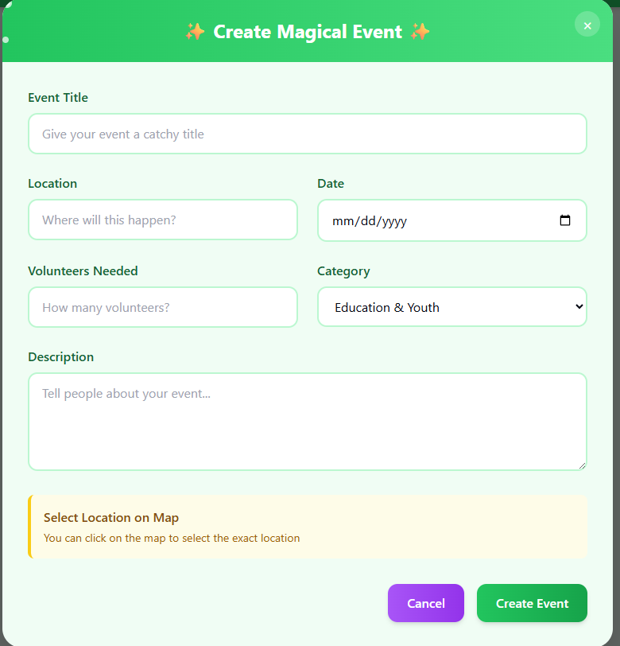

# 🌱 GoodHub

GoodHub is a web application designed to connect environmentally conscious individuals with local and global volunteer opportunities. The platform empowers users to discover, join, and create sustainability-focused events through an intuitive, interactive map interface.

---

## 🌍 Project Overview

GoodHub aims to:

- Promote environmental sustainability and community engagement.
- Centralize eco-volunteering opportunities for easier access.
- Improve visibility for grassroots environmental initiatives.
- Provide tools for individuals and groups to take actionable steps.

---

## 🌟 Vision & Social Impact

GoodHub addresses critical gaps in environmental activism:

- Difficulty locating local volunteer opportunities
- Lack of centralized platforms for sustainability efforts
- Limited visibility for community-led initiatives
- Low community participation due to lack of accessibility

By connecting passionate individuals to actionable causes, EcoVolunteer makes direct environmental impact more accessible and collaborative.

---

## 🛠️ Tech Stack

- **Frontend**: React.js
- **Backend/Storage**: Python, SQL
- **Map Integration**: Leaflet API
- **Languages**: JavaScript, HTML, CSS
- **State Management**: React Context API / Redux
- **Responsive Design**: Media queries and viewport-based layout adjustments

---

## ⚙️ Core Features 

### 🗺️ Interactive Map Interface
- Map shows dynamic pins for volunteer events
- Zoom, pan, and custom pin icons by event type
- Pin highlights when corresponding event card is selected

### 📋 Event Sidebar
- Collapsible sidebar with a searchable list of events
- Event preview cards with key info
- Create Event button

### 📌 Event Management
- View detailed event pop-ups via modal
- Submit new events via event creation form
- Register for participation
- Filter by date, type, and location
- SQL-based event storage (add/remove with pin sync)

### 🔍 Search Bar
- Search events and display matching results dynamically in sidebar or map

### 🧭 User Experience Highlights
- Synchronized interaction between map and sidebar
- Visual feedback on selection
- Clean mobile and desktop layouts

---

## 👥 Community-Driven Features

- **Team Challenges**: Create/join groups for eco-challenges (e.g. “City Cleanup Squad”)
- **Event Seeds**: Users propose ideas like “Plant 100 trees,” matched with organizers
- **Eco-Forums**: Community discussions on sustainability, DIY projects, or policy advocacy

---

## 🧑‍🤝‍🧑 Daily Challenge

### 💬 Challenge Post Flashcards
- **Title**: Event name
- **Description**: Event details
- **Join Button**: Request contact info from the group owner
- **Dynamic Display**: Shows current active members
- Flashcards auto-remove when full
- Scrollable layout with limited card size

---

## 🧑‍💼 User Profile 

### 📱 Mobile View
- Profile info stacked vertically
- Hosted & joined events listed in full-width cards

### 💻 Tablet/Desktop View
- Horizontal profile header layout
- Two-column layout for events
- Consistent card sizing

---

## 📱 Responsive Design Approach

### Mobile
- Full-width map with collapsible sidebar
- Stacked event cards
- Modal uses most of the screen

### Tablet
- Split layout: 60% map / 40% sidebar
- Scrollable event cards

### Desktop
- 70% map / 30% sidebar
- Multi-column card display (if space allows)

---

## 🏗️ System Architecture

